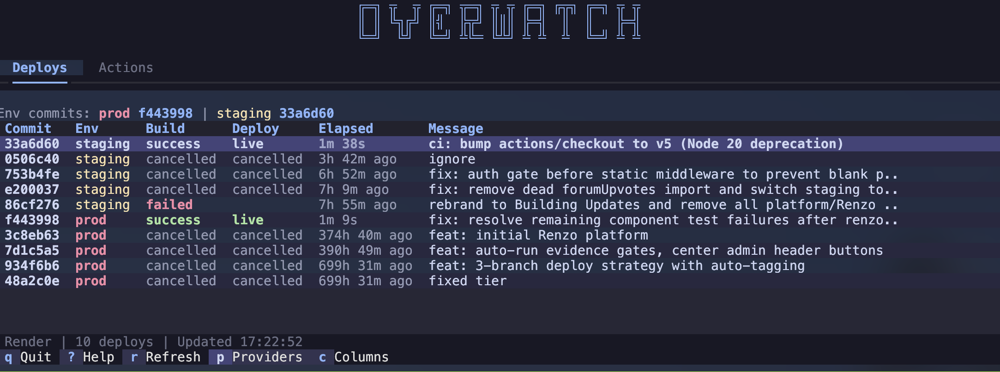
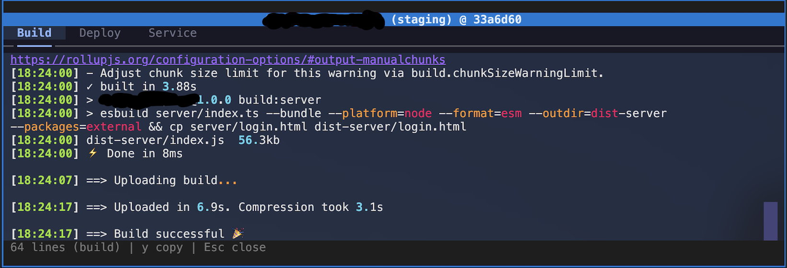

# Overwatch

A terminal dashboard for monitoring deployments and GitHub Actions across your services.





## Features

- **Multi-service deploy monitoring** — see build/deploy status across all services at a glance
- **Environment-aware** — infers prod/staging/dev from branch names
- **Tabbed log viewer** — build, deploy, and service logs with copy support
- **Configurable columns** — choose which columns to show and reorder them
- **Responsive layout** — adapts to narrow terminal panes
- **Instant startup** — caches last fetch for immediate display
- **GitHub Actions tab** — monitor workflow runs alongside deploys

## Providers

- **Render** (`renderdotcom.py`)
- **DigitalOcean** (`digitalocean.py`)

## Usage

```bash
python -m overwatch
```

Options:
```
--project-dir DIR    Project directory (defaults to git root or cwd)
--providers-dir DIR  Path to providers directory
--dash-id ID         Dashboard instance ID
```

## Keyboard Shortcuts

| Key | Action |
|-----|--------|
| `j` / `k` | Navigate rows |
| `Enter` | Open action menu (website, deploy page, logs) |
| `r` | Refresh |
| `c` | Configure columns |
| `p` | Provider settings |
| `Tab` | Switch between Deploys / Actions tabs |
| `?` | Help |
| `q` | Quit |

## Configuration

Settings are stored in `.deploy-watch.json` in your project directory:

```json
{
  "provider": "renderdotcom.py",
  "renderdotcom.py": {
    "ownerId": "tea-xxx",
    "apiKeyEnv": "RENDER_DOT_COM_TOK"
  },
  "tabs": {
    "deploys": {
      "columns": ["Commit", "Env", "Build", "Deploy", "Elapsed", "Message"]
    },
    "actions": {
      "repo": "owner/repo"
    }
  }
}
```

## Requirements

- Python 3.10+
- `textual >= 0.80.0`
- `rich >= 13.0.0`
